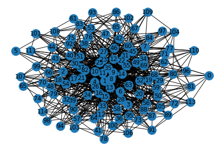
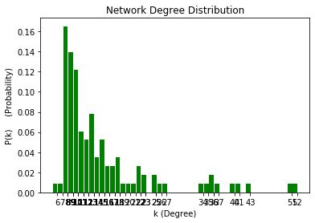
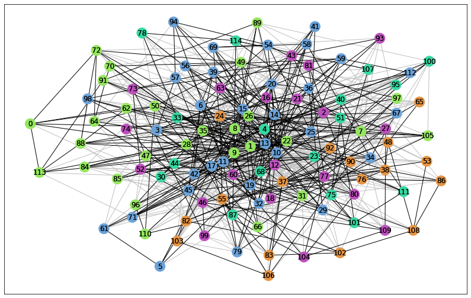
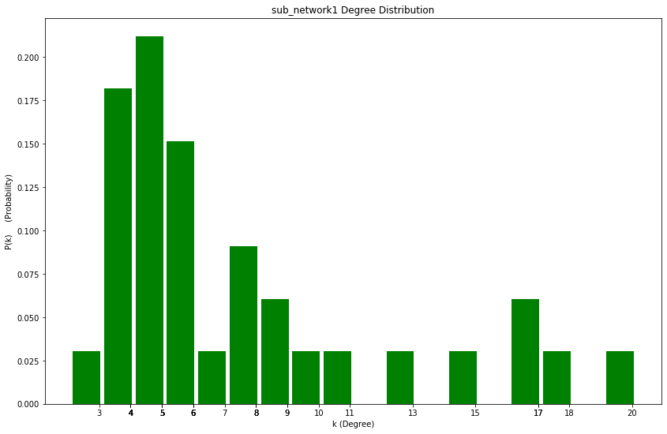
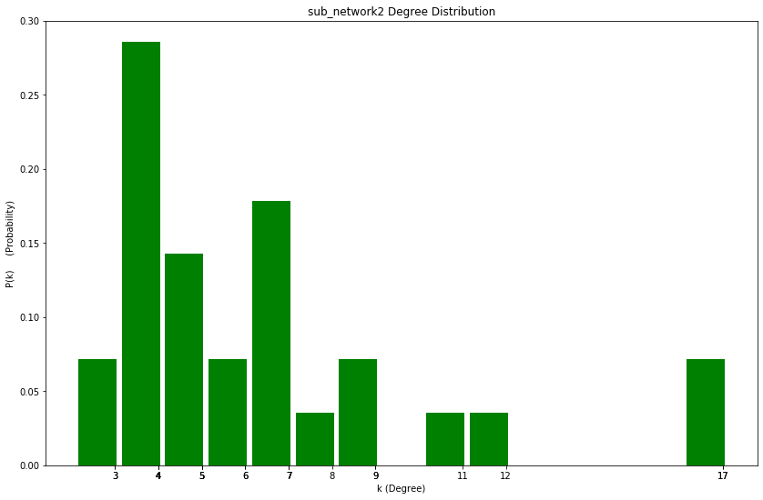
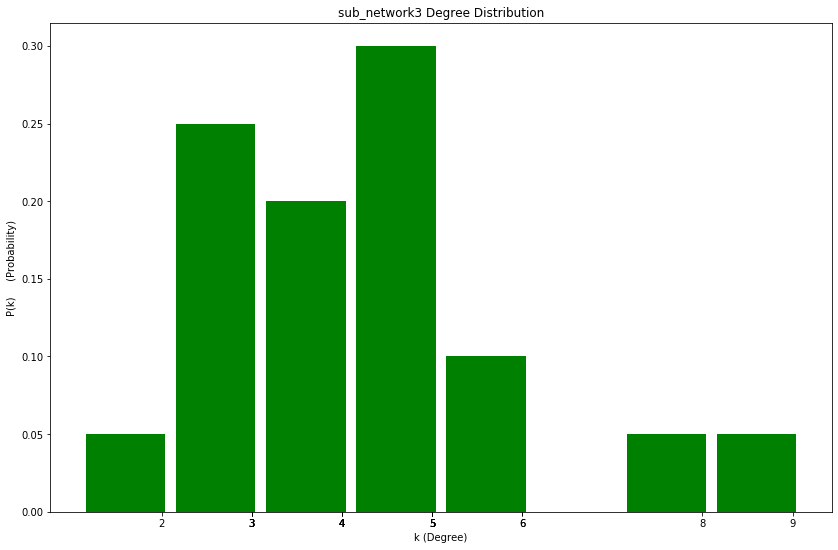
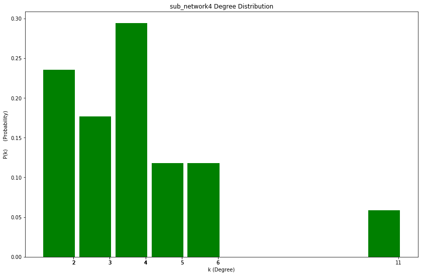
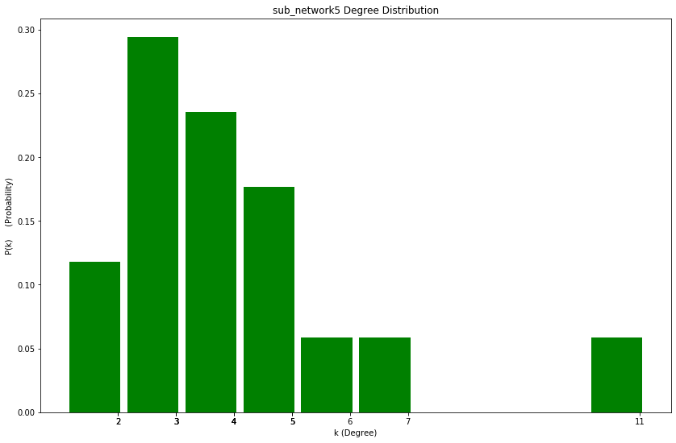

# Random-Social-Network-Analysis











## Installation
you need to install Python Networkx Library to run the program.
Use the package manager [pip](https://pypi.org/project/networkx/) to install Networkx.

```bash
pip install networkx
```
